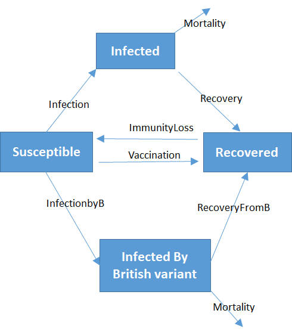

```{r setupA, include=FALSE}
knitr::opts_chunk$set(echo = TRUE)
```

# Exercise 1 ANSWER. Lake biomanipulation.

{width=70%}

* Possible forcing function could be f1, the inflow of DIP
* Suitable units: mol P $m^{-3}$
* The effects of biomanipulation can be investigated by changing f10.

# Exercise 2 ANSWER.	Bacterial decay of particulate organic matter in marine sediments.

{width=70%}

Note the respiration that consists of two parts, basal respiration (a continuous process), and growth respiration (linked to bacterial growth).

# Exercise 3 ANSWER. Spread of the Corona virus. 

## Basic SIR model

{width=70%}

## SIR model with vaccination

{width=70%}

## SIR model with British variant

{width=70%}

The assumptions are:

* immunity is gained for all variants whatever variant a person was infected with. 
* vaccination protects against all corona variants.


# Exercise 4 ANSWER.	Crops and weed.

{width=70%}

* fertilize once before planting can be implemented by increasing the initial concentratino of P in the upper layer
* fertilize regularly after planting is implemented as a flux (called *Paddition* in the scheme)

