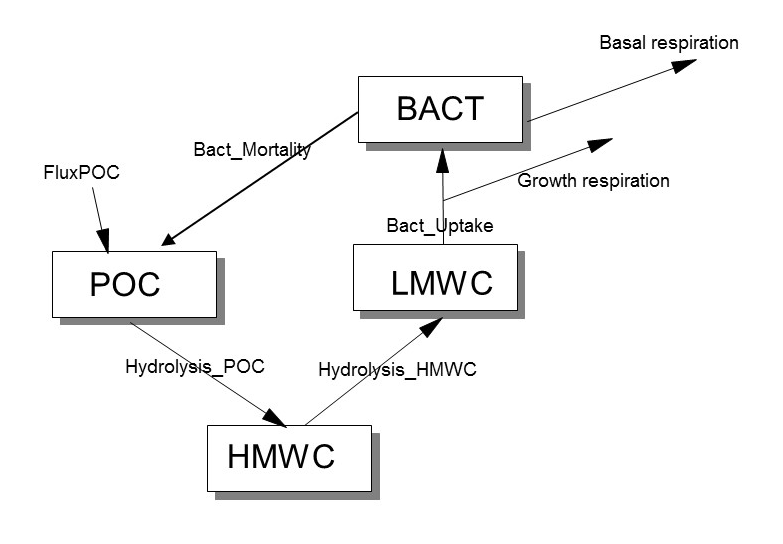
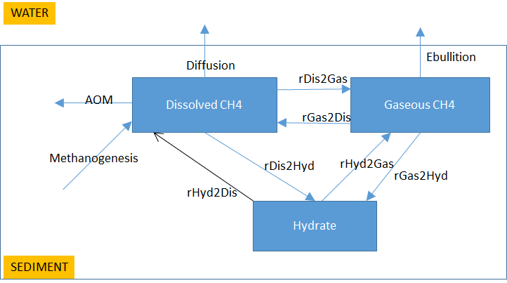
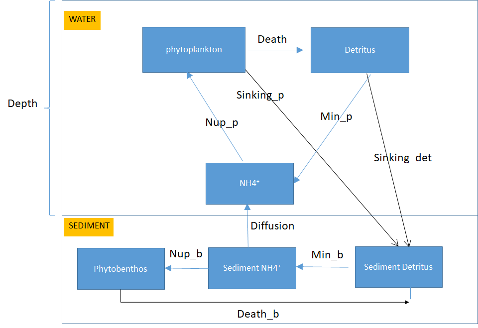

```{r setup_A, include=FALSE}
knitr::opts_chunk$set(echo = TRUE)
```

# Exercise 1 ANSWER. Bacterial decay of particulate organic matter in marine sediments.

Based on the following

{width=70%}

the mass balance equations are:

$$\frac{dPOC}{dt} = FluxPOC + Bact\_Mortality - Hydrolysis\_POC$$
$$\frac{dHMWC}{dt} = Hydrolysis\_POC - Hydrolysis\_HMWC$$
$$\frac{dLMWC}{dt} = Hydrolysis\_HMWC - Bact\_uptake$$
$$\frac{dBACT}{dt} = Bact\_uptake - Growth\_respiration - Basal\_respiration - Bact\_Mortality$$


# Exercise 2 ANSWER. Methane dynamics in wetlands

Based on the following reactions:
$$R_1:\qquad  CH_3COOH \rightarrow CH_4 + CO_2$$
$$R_2:\qquad  CO_2 + 4H_2 \rightarrow CH_4 + 2H_2O$$
$$R_3:\qquad  CH_4 + 2O_2 \rightarrow CO_2 + 2H_2O$$

and the addition fluxes $CH_3COOHburial$, $CH_3COOHinput$, $CH4_emission$, $CH_4burial$, $CO_2emission$, $CO_2burial$, $O_2influx$, the Mass balances can be written as:
$$\frac{dCH3COOH}{dt} = -R_1 - CH_3COOHburial + CH_3COOHinput$$
$$\frac{dCH4}{dt} = R_1 + R_2 - R_3 - CH_4emission - CH_4burial$$
$$\frac{dCO2}{dt} = R_1 - R_2 + R_3 - CO_2emission - CO_2burial$$
$$\frac{dO2}{dt} = - 2R_3 + O_2influx$$

### Model application

To estimate the fluxes, we use the linear equations:
$$41 = R_1+R_2-R_3$$
$$31 = R_1-R_2+R_3$$
$$20 = 2R_3$$

so the derived fluxes are:
$R_1=36, R_2=15, R_3=10$ mmol $m^2d^{-1}$

# Exercise 3 ANSWER. Methane removal by anoxic processes in marine sediments.

Based on the conceptual scheme:

{width=70%}

we can write the following mass balance equations:
$$\frac{dCH4_{diss}}{dt} = Methanogenesis + rHyd2Dis - rDis2Hyd + rGas2Dis - rDis2Gas  - AOM - Diffusion$$
$$\frac{dCH4_{gas}}{dt} = rHyd2Gas - rGas2Hyd + rDis2Gas - rGas2Dis - Ebullition$$
$$\frac{dCH4_{hyd}}{dt} = -rHyd2Gas + rGas2Hyd + rDis2Hyd - rHyd2Dis $$

# Exercise 4 ANSWER. The coupled cycles of carbon, nitrogen and oxygen in marine sediments.

Based on the following reactions

$$OxicMin: \qquad (CH_2O)_1(NH_3)_{NC}(H_3PO_4)_{PC} + O_2  \rightarrow  CO_2 + _{NC} \cdot NH_3 + _{PC} \cdot H_3PO_4 + H_2O$$
$$Denitri: \qquad (CH_2O)_1(NH_3)_{NC}(H_3PO_4)_{PC} + 4/5 HNO_3 \rightarrow CO_2 + 2/5 N_2 + _{NC} \cdot NH_3 + _{PC} \cdot H_3PO_4 + 7/5 H_2O$$
$$AnoxicMin: \qquad (CH_2O)_1(NH_3)_{NC}(H_3PO_4)_{PC} + XO_2 \rightarrow CO_2 + X + _{NC} \cdot NH_3 + _{PC} \cdot H_3PO_4 + H_2O$$
$$Nitri: \qquad NH_3 + 2 O_2   \rightarrow  HNO_3 + H_2O$$
$$Reox: \qquad X + O_2  \rightarrow XO_2$$

and taking into account in- and outfluxes, 
we have the following mass balances:
$$\frac{dCOrg}{dt} = OrgDepo - oxicMin - Denitri - anoxicMin$$
$$\frac{dO2}{dt} = O2influx - oxicMin - 2 \times Nitri - Reox$$
$$\frac{dCO2}{dt} = CO2influx + oxicMin + Denitri + anoxicMin$$
$$\frac{dHNO3}{dt} = HNO3influx - 0.8 \times Denitri + Nitri$$
$$\frac{dNH3}{dt} = NH3influx +16/106 \times (oxicMin + Denitri + anoxicMin) - Nitri$$
$$\frac{dX}{dt} = Xinflux + anoxicMin - Reox$$
$$\frac{dXO2}{dt} = XO2influx - anoxicMin + Reox$$

* Suitable units for the state variables are $mol~m^{-2}$.
* The units of the time derivatives and of the rates are $mol~m^{-2}~d^{-1}$

The mass balance equations for the water column components are:
$$\frac{dO2_{wat}}{dt} = - O_2influx / Height_{water}$$

$$\frac{dNH3_{wat}}{dt} = - NH_3influx / Height_{water}$$

etc...

*suitable UNITS, compatible with the sediment units are $mol~m^{-3}$, units of derivatives and rates:  $mol~m^{-3} d^{-1}$


# Exercise 5 ANSWER. Benthic and pelagic primary producers in shallow seas.

{width=70%}


* Water column constituents, in mol N $m^{-3}$, rates in mol N $m^{-3} d^{-1}$, except for sinking and diffusion, which is in mol N $m^{-2} d^{-1}$.

Mass balance equations:

$$\frac{dPhyto}{dt} = Nup\_p - Death - Sinking\_p/Depth$$
$$\frac{dDetitrus}{dt} = Death - Min\_p - Sinking\_det/Depth$$
$$\frac{dNH_4}{dt} = Min\_p - Nup\_p + Diffusion/Depth$$
$$\frac{dSediment_{detritus}}{dt} = Sinking\_det + Sinking\_p + Death\_b - Min\_b$$
$$\frac{dSediment_{NH4}}{dt} = Min\_b - Nup\_b - Diffusion$$
$$\frac{dPhytobenthos}{dt} = Nup\_b - Death\_b$$
