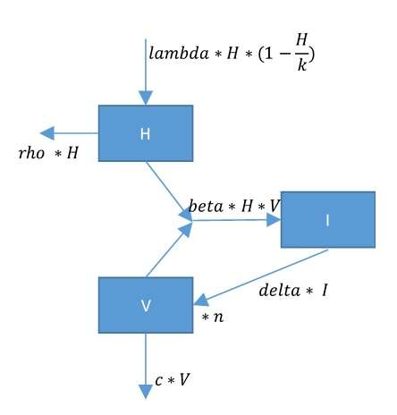

# Questions

## Problem formulation


In this exercise you get the model equations that you need to interpret.

The model is devised to study the impact of viruses in the aquatic milieu. Viral infection is of considerable interest in aquatic sciences, where viruses are deemed important factors in biogeochemical cycles, and causing death in a variety of organisms, including algae.

The equations were adapted from a model that describes the dynamics of the *HIV* virus, responsible for the acquired immune-deficiency syndrome (AIDS). 

It describes three components, comprising the number of uninfected, healthy (*H*) and infected (*I*) algal cells, and the number of free virions (*V*).


## Tasks

Based on the flow chart:

* What are suitable units of the state variables?
*	Give a name to each flow (arrow) - try to understand the mechanistic equation for each flow (which equation has been chosen and why?).
*	What are the units of all the parameters?
*	Create the mass balance equations, using the flow names you just assigned.
*	Replace each flow by its mechanistic equation as represented in the flowchart.


```{r setup, include=FALSE}
library(knitr)
knitr::opts_chunk$set(echo = TRUE)
```

* Implement this model in *R*. You can start with the R-markdown template model file *RTM_0D.Rmd* \footnote{you can download this file from Rstudio: "File->new File->Rmarkdown..->from template->RTM_0D". Save this file under a different name, do not forget to change the heading of this file.}. 

Adapt the R-code from the R-template file to represent the viral infection model. 

Use for initial conditions the following:

| state variable | Value    |
|----------------| --------------|
| H	| 100   |
| I	| 150   |
| V	| 50000 |

And for the parameters:

| parameter | Value   |
|--------| -----------|
| lambda | 	1         |
| rho	   |  0.15      |
| delta	 | 0.55       |
| beta   | 	0.00002   |
| c	     | 5.5        |
| k      | 1e5        |
| n	     | 100        |

Run the model for one year

