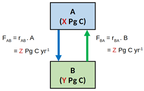

```{r setup, include=FALSE}
knitr::opts_chunk$set(echo = TRUE)
library(learnr)
```

## Tutorial

You are advised to watch the following video first 


(there are no corresponding sections of the book)

## Two-box model

Figure below shows a conceptual diagram of a system in a steady state, including the rate laws describing the fluxes of carbon (C) between the compartments A and B. The values of X, Y and Z are as follows: [1e3], [1e5], [100].



The R chunk below sets the values of the parameters.

```{r rab-setup}
X <- 1e3
Y <- 1e5
Z <- 100
```

What is the value of the rate constant $r_AB$? 
 
Use R to estimate it - X, Y and Z have the values as given above.

```{r rab, exercise=TRUE}
# fill in the equation
rAB <- 
```

<div id="rab-hint">
**Hint:** the equation to use is depicted in the figure
</div>

```{r rab-solution}
rAB <- Z/X
```

 What is the value of the rate constant $r_BA$? 
 
 Use R to estimate it - X, Y and Z have the values as given above:

```{r rba, exercise=TRUE}
# fill in the equation
rBA <- 
```

<div id="rba-hint">
**Hint:** the equation to use is depicted in the figure
</div>

```{r rba-solution}
rBA <- Z/Y
```

What is the residence time of carbon in compartment A? 
 
Use R to estimate it - X, Y and Z have the values as given above:

```{r rta, exercise=TRUE}
# fill in the equation
rtA <- 
```

```{r rta-solution}
rtA <- X/Z
```

<div id="rta-hint">
**Hint:** the residence time is the amount of material in the reservoir ([pgC]), divided by the outflow ([pgC yr$^{-1}$]).
</div>

What is the residence time of carbon in compartment B? 
 
Use R to estimate it - X, Y and Z have the values as given above:


```{r rtb, exercise=TRUE}
# fill in the equation
rtB <- 
```

<div id="rtb-hint">
**Hint:** the residence time is the amount of material in the reservoir ([pgC]), divided by the outflow ([pgC yr$^{-1}$]).
</div>

```{r rtb-solution}
rtB <- Y/Z
```

## Implementation in R

Based on the reader that has introduced you to solving dynamic models in R, it should be simple to understand the following code, that implements the two-box model in R:

```{r, message=FALSE}
```

## Challenging question 1

The system has been perturbed from the steady state by adding 100 Pg C from an external source to A. 

This perturbation did not affect the rate laws nor the rate constants. After some time, the system returned to a steady state. What are the amounts of C in the two compartments in this steady state? 

 Use R to estimate the response time - X, Y and Z have the values as given above:


```{r pertAdd, exercise=TRUE}
Xeq <- 
Yeq <-   
```

```{r pertAdd-solution}
Xeq <- X/(X+Y) *(X+Y+100)
Yeq <- Y/(X+Y) *(X+Y+100)
```

<div id="pertAdd-hint">
**Hint:** You may use the following equalities that apply at steady-state:
<BR> 1. the sum of A and B after perturbation will be = X+Y+100
<BR> 2. at equilibrium the forward rate ($F_{AB}$) will be equal to the backward rate ($F_{BA}$)
</div>


## Finally

```{r feedback, echo = FALSE}
question("give your feedback ", type = "learnr_text", answer(" ", correct=TRUE), correct="thank you", incorrect = "thank you")
```
