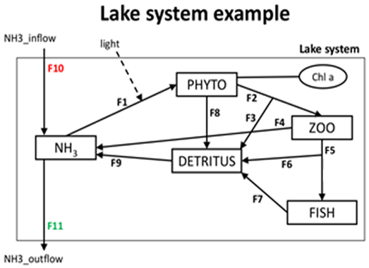
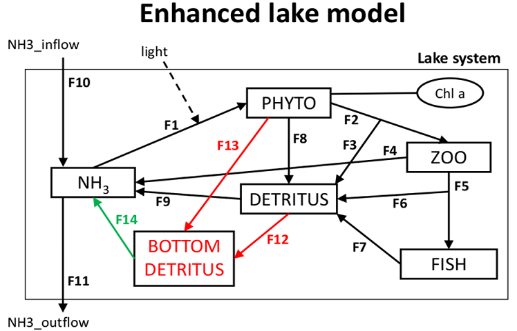

```{r setup, include=FALSE}
knitr::opts_chunk$set(echo = TRUE)
library(learnr)
```

## Tutorial

You are advised to watch the following video first 


and/or read the following sections of the book:

* Chapter 2.1. Conceptual model

(You can download each chapter of this book via the e-book University library for free!)


## Mass balance of a lake ecosystem

Consider the conceptual diagram of a simple lake ecosystem model shown below. The state variables represent nitrogen (N) concentrations in the major lake compartments. Each state variable is in moles of N per cubic meter of water column, each flux is in moles of N per cubic meter of water column per day, water column height is h = 10 m.

{width=50%}

```{r ingredients_PHYTO, echo=FALSE}
question("Which of the following differential equations correctly describe mass balances for phytoplankton?", type = "learnr_checkbox",
 answer("d[PHYTO]/dt = F1 - F2 - F8", correct=TRUE),
 answer("d[PHYTO]/dt = -F1 + F2 + F8", correct=FALSE),
 answer("d[PHYTO]/dt = F1 - F2 - F8 + light", correct=FALSE),
 answer("d[PHYTO]/dt = F1 - F2 - F8 - F3", correct=FALSE)
  )
```

{width=50%}
```{r ingredients_ZOO, echo=FALSE}
question("Which of the following differential equations correctly describe mass balances for zooplankton?", type = "learnr_checkbox",
 answer("d[ZOO]/dt = F2 - F4 - F5", correct=FALSE),
 answer("d[ZOO]/dt = F2 - F3 - F4 - F5", correct=TRUE),
 answer("d[ZOO]/dt = F2 - F4 - F5 - F6", correct=FALSE),
 answer("d[ZOO]/dt = F2 - F3 - F4 - F5 - F6", correct=FALSE)  
)
```

{width=50%}

```{r ingredients_DET, echo=FALSE}
question("Which of the following differential equations correctly describe mass balance for detritus?", type = "learnr_checkbox",
 answer("d[DETRITUS]/dt = F2 + F6 - F5 + F7 + F8 - F9", correct=FALSE),
 answer("d[DETRITUS]/dt = F3 + F6 + F7 + F8 - F9/h", correct=FALSE),
 answer("d[DETRITUS]/dt = F3 + F6 + F7 + F8 - F9", correct=TRUE),
 answer("d[DETRITUS]/dt = F3 + F6 + F7 + F8 - F9*h", correct=FALSE)  
  )
```

{width=50%}
```{r ingredients_NH3, echo=FALSE}
question("Which of the following differential equations correctly describe mass balances for ammonia?", type = "learnr_checkbox",
 answer("d[NH3]/dt = F4 + F9/h - F1 + F10 - F11", correct=FALSE),
 answer("d[NH3]/dt = F4 + F9 - F1 + F10 - F11", correct=TRUE),
 answer("d[NH3]/dt = F4 + F9 - F1 + F10/h - F11", correct=FALSE)
  )
```

```{r NumberEquations, echo=FALSE}
question("How many differential equations are needed to fully describe mass balances in the lake model", type = "learnr_radio",
answer("1"),
answer("2"),
answer("3"),
answer("4"),
answer("5", correct=TRUE),
answer("6"),
answer("7"),
incorrect = "You will have as many mass balance equations as there are state variables", 
correct = "You will have as many mass balance equations as there are state variables"
  )
```

```{r UnitsEquations, echo=FALSE}
question("Tick the sentence that is true", type = "learnr_radio",
answer("Modeled state variables MUST have the same units"),
answer("Modeled state variables CANNOT have the same units"),
answer("Modeled state variables should have the same units if possible", correct = TRUE)
)
```

## Enhanced lake ecosystem

Consider the conceptual diagram of an enhanced lake ecosystem model shown below. The state variables represent nitrogen (N) concentrations in the major lake compartments. Each state variable except for the BOTTOM_DETRITUS is in moles of N per cubic meter of water column, each flux except for F12, F13 and F14 is in moles of N per cubic meter of water column per day, The new state variable BOTTOM_DETRITUS is in moles of N per square meter of lake bottom, the new fluxes F12, F13 and F14 are in moles of N per square meter of lake bottom per day, water column height is h = 10 m.

{width=50%}

```{r PHYTO, echo=FALSE}
question("Which of the following differential equations correctly describe mass balances for the PHYTO state variable?", type = "learnr_checkbox",
 answer("d[PHYTO]/dt = F1 - F2 - F8- F13", correct=FALSE),
 answer("d[PHYTO]/dt = F1 - F2 - F8- F13*h", correct=FALSE),
 answer("d[PHYTO]/dt = F1 - F2 - F8- F13/h", correct=TRUE),
 answer("d[PHYTO]/dt = F1/h - F2/h - F8/h- F13", correct=FALSE),
 answer("d[PHYTO]/dt = F1*h - F2*h - F8*h- F13", correct=FALSE),
 incorrect = "F13, the sinking of phytoplankton will be expressed in molN/m2/day (you will see later why), hence you need to divide by the height of the water to convert the flow to molN/m3/day", 
 correct = "F13, the sinking of phytoplankton will be expressed in molN/m2/day (you will see later why), hence you need to divide by the height of the water to convert the flow to molN/m3/day"
)
```
{width=50%}
```{r DET, echo=FALSE}
question("Which of the following differential equations correctly describe mass balances for the DETRITUS state variable?", type = "learnr_checkbox",
 answer("d[DETRITUS]/dt = F2 + F6 - F5 + F7 + F8 - F9 - F12", correct=FALSE),
 answer("d[DETRITUS]/dt = F2 + F6 - F5 + F7 + F8 - F9 - F12*h", correct=FALSE),
 answer("d[DETRITUS]/dt = F2 + F6 - F5 + F7 + F8 - F9 - F12/h", correct=TRUE),
 incorrect = "F12, the sinking of detritus is expressed in molN/m2/day (you will see later why). Thus you need to divide by the height of the water column to convert the flow to molN/m3/day", 
 correct = "F12, the sinking of detritus is expressed in molN/m2/day (you will see later why). Thus you need to divide by the height of the water column to convert the flow to molN/m3/day"
)
```
{width=50%}
```{r BotDet, echo=FALSE}
question("Which of the following differential equations correctly describe mass balances for the BOTTOM DETRITUS state variable?", type = "learnr_checkbox",
 answer("d[BOTTOM_DETRITUS]/dt = F12*h + F13*h - F14*h", correct=FALSE),
 answer("d[BOTTOM_DETRITUS]/dt = F12 + F13 - F14", correct=TRUE),
 answer("d[BOTTOM_DETRITUS]/dt = F12/h + F13/h - F14hh", correct=FALSE),
 incorrect = "F12 and F13, the sinking of detritus and algae are expressed in molN/m2/day and therefore have the correct units for a flux to bottom detritus", 
 correct = "F12 and F13, the sinking of detritus and algae are expressed in molN/m2/day and therefore have the correct units for a flux to bottom detritus"
)
```
{width=50%}

```{r pelagicNH3, echo=FALSE}
question("Which of the following differential equations correctly describe mass balances for the ammonia state variable?", type = "learnr_checkbox",
answer("d[NH3]/dt = F4 + F9h - F1 + F10 - F11 + F14", correct=FALSE),
 answer("d[NH3]/dt = F4 + F9 - F1 + F10 - F11+ F14/h", correct=TRUE),
 answer("d[NH3]/dt = F4 + F9 - F1 + F10/h - F11+ F14*h", correct=FALSE),
   incorrect = "F14, is estimated based on the bottom detritus concentraton, and has units of molN/m2/day; it must thus be divided by height to obtain the correct units for a flux to ammonia", 
correct = "F14, is estimated based on the bottom detritus concentraton, and has units of molN/m2/day; it must thus be divided by height to obtain the correct units for a flux to ammonia"
  )
```

## Biogeochemical reaction

Consider organic matter (OM) mineralization in a water column. Under anoxic conditions (no $O_2$ available), OM can be mineralized with nitrate ($NO_3^-$) as the electron acceptor (Denitrification). The corresponding stoichiometry of the reaction is given by the equation below, where 16/106 corresponds to the Redfield (molar) ratio of C:N in OM. 

$$
5CH_2O(NH_3)_{16/106}+4NO_3^-+4H^+ \rightarrow 5CO_2+7H_2O+2N_2+5(NH3)_{16/106}
$$

* Assume that the rate of OM mineralization is $R$, in units of $mol~C~m^{-3} h^{-1}$.
* Concentrations of OM and $CO_2$ are in $mol~C~m^{-3}$, concentrations of nitrate and ammonia are in $mol~N~m^{-3}$, and the concentration of dissolved $N_2$ gas is in $mol~N_2~m^{-3}$, where $m^3$ refers to the cubic meter of water column. Assume that OM mineralization is the only process in the system.

```{r Denitrification, echo=FALSE}
question("Which of the following differential equations correctly describe mass balances for the system?", type = "learnr_checkbox",
 answer("d[OM]/dt = -5*R", correct=FALSE),
 answer("d[OM]/dt = -R", correct=TRUE),
 answer("d[OM]/dt = -(1/5)*R", correct=FALSE),
 answer("d[CO2]/dt = 5*R", correct=FALSE),
 answer("d[CO2]/dt = (1/5)*R", correct=FALSE),
 answer("d[CO2]/dt = -R", correct=FALSE),
 answer("d[CO2]/dt = R", correct=TRUE),
 incorrect = sprintf("As R is expressed in $mol~C~m^{-3} h^{-1}$, it is simplest to rewrite the chemical reaction so that one mole of C reacts, i.e.: $CH_2O(NH_3)_{16/106}+4/5NO_3^-+4/5H^+ \\rightarrow CO_2+7/5H_2O+2/5N_2+(NH3)_{16/106}$ . This will make the mass balances clear"),  
 correct = sprintf("As R is expressed in $mol~C~m^{-3} h^{-1}$, it is simplest to rewrite the chemical reaction so that one mole of C reacts, i.e.: $CH_2O(NH_3)_{16/106}+4/5NO_3^-+4/5H^+ \\rightarrow CO_2+7/5H_2O+2/5N_2+(NH3)_{16/106}$ . This will make the mass balances clear")  
)
```

$$
5CH_2O(NH_3)_{16/106}+4NO_3^-+4H^+ \rightarrow 5CO_2+7H_2O+2N_2+5(NH3)_{16/106}
$$
  
```{r Denitrification2, echo=FALSE}
question(sprintf("Which of the following differential equations correctly describe mass balances for the system ?  R has units of $mol~C~m^{-3} h^{-1}$."), type = "learnr_checkbox",
 answer("d[NO3]/dt = -4*R", correct=FALSE),
 answer("d[NO3]/dt = 4*R", correct=FALSE),
 answer("d[NO3]/dt = -(4/5)*R", correct=TRUE),
 answer("d[NO3]/dt = -(5/4)*R", correct=FALSE),
 answer("d[NH3]/dt = -5*R", correct=FALSE),
 answer("d[NH3]/dt = 5*R", correct=FALSE),
 answer("d[NH3]/dt = (16/106)*R", correct=TRUE),
 answer("d[NH3]/dt = -(16/106)*R", correct=FALSE),
 answer("d[NH3]/dt = 5*(16/106)*R", correct=FALSE),
 answer("d[NH3]/dt = -(106/16)*R", correct=FALSE),
 answer("d[N2]/dt = 2*R", correct=FALSE),
 answer("d[N2]/dt = (2/5)*R", correct=TRUE),
 answer("d[N2]/dt = (4/5)*R", correct=FALSE),
 answer("d[N2]/dt = 4*R", correct=FALSE),
 answer("d[N2]/dt = R", correct=FALSE),
 answer("d[N2]/dt = (1/2)*R", correct=FALSE),
 incorrect = sprintf("As R is expressed in $mol~C~m^{-3} h^{-1}$, it is simplest to rewrite the chemical reaction so that one mole of C reacts, i.e.: $CH_2O(NH_3)_{16/106}+4/5NO_3^-+4/5H^+ \\rightarrow CO_2+7/5H_2O+2/5N_2+(NH3)_{16/106}$ - then the mass balances are clear"),  
 correct = sprintf("As R is expressed in $mol~C~m^{-3} h^{-1}$, it is simplest to rewrite the chemical reaction so that one mole of C reacts, i.e.: $CH_2O(NH_3)_{16/106}+4/5NO_3^-+4/5H^+ \\rightarrow CO_2+7/5H_2O+2/5N_2+(NH3)_{16/106}$ - then the mass balances are clear")  
 )
```

## Photosynthesis - conceptual model

Photosynthesis (PS) is a process used by plants to convert light energy into carbohydrates. In the first step, the photosystem II (PSII), enzymes capture photons of light that energize electrons and ultimately produce NADPH and ATP, the proton and energy source for the Calvin cycle that converts $CO_2$ into carbohydrates.

A simple representation of the PSII system considers three states: 

(1) an open or reactive PSII state, 
(2) a closed or activated state and 
(3) an inhibited state. 

After being hit by photons, the PSII transits from an open state to a closed one. The excited electrons are then transferred to the terminal electron acceptors, and the PSII system returns to the open state. Excessive absorption of light leads to photo-inhibition, that shifts the system from the closed to the inhibited state, from which it slowly recovers. 


In the scheme above, you find the three states that are used in this PS model. Based on the above description, draw the arrows that represent the transitions from each state to the other state.  If we define with *Fab* the transition rate from state a to b, then tick the boxes that should be added in this conceptual scheme:

```{r flows, echo=FALSE}
question("If Fab denotes the transition flow from state a to b, toggle the correct fluxes", type = "learnr_checkbox",
 answer("Foc", correct=TRUE),
 answer("Fco", correct=TRUE),
 answer("Foi"),
 answer("Fio"),
 answer("Fci", correct=TRUE),
 answer("Fic", correct=TRUE),
 incorrect = ("the transition flows are Foc, Fco, Fci an Fic")  
)
```

## Photosynthesis - mass balance

You are given the following conceptual diagram of the PSII model.


* Write the mass balance equations for the state variables "[o]", "[c]" and "[i]":

```{r PS_MB, echo=FALSE}
question("Which of the following equations represent the balance equation for state 'c' ?", type = "learnr_radio",
 answer(sprintf("$\\frac{d[c]}{dt}=Foc-Fco+Fic-Fci$"), correct=TRUE),
 answer(sprintf("$\\frac{d[c]}{dt}=-Foc+Fco-Fic+Fci$")),
 answer(sprintf("$\\frac{d[c]}{dt}=Foc+Fco$"))
 )
```

## Photosynthesis - units

* The state variables "[o]", "[c]", "[i]" are fractions that sum to 1 (i.e. they are unitless). 

```{r PS_units, echo=FALSE}
question("If the time-unit in the model is 'second', what is the unit of the derivative $\\frac{d[i]}{dt}$ ", type = "learnr_radio",
 answer(sprintf("$s$")),
 answer(sprintf("$/s$"), correct=TRUE),
 answer(sprintf("$-$ (unitless)")),
incorrect = "the unit of a time-derivative = unit of the state variable per time",   
correct = "indeed: the unit of a time-derivative = unit of the state variable per time"
 )
```

* The rate expression for $F_{ic}$ is equal to 
$$F_{ic} = r \cdot [i]$$ 

```{r PSunitFic, echo=FALSE}
question("What is the unit of parameter $r$ ?", type = "learnr_radio",
 answer(sprintf("$s$")),
 answer(sprintf("$s^{-1}$"), correct=TRUE),
 answer(sprintf("$-$ (unitless)")),
 incorrect = sprintf("The unit of the flow $F_{ic}$ is $s^{-1}$, and [i] is unitless, hence $r$ has units of $s^{-1}$."),  
 correct = sprintf("The unit of the flow $F_{ic}$ is $s^{-1}$, and [i] is unitless, hence $r$ has units of $s^{-1}$.")  
 )
```

* The rate expression for $F_{oc}$ is equal to 
$$F_{oc} =\sigma \cdot I \cdot [o],$$ 
where the unit of $I$ (light) is $\mu$ mol photons $m^{-2} s^{-1}$. 

```{r psunitfoc, echo=FALSE}
question("What is the unit of parameter $\\sigma$", type = "learnr_radio",
 answer(sprintf("$s$")),
 answer(sprintf("$m^2 (\\mu mol~photons) ^{-1}$"), correct=TRUE),
 answer(sprintf("$s^{-1}$")),
 answer(sprintf("$\\mu mol~photons ~s^{-1}$")),
 incorrect = sprintf("The unit of the flow $F_{oc}$ is $s^{-1}$, and $I \\cdot [o]$ has units of $\\mu$ mol photons $m^{-2} s^{-1}$. To obtain unit of $s^{-1}$, $\\sigma$ must be expressed in $m^2 (\\mu$ mol photons) $^{-1}$ (The parameter $\\sigma$ is called the absorption cross section of PSII)."),  
 correct = sprintf("The unit of the flow $F_{oc}$ is $s^{-1}$, and $I \\cdot [o]$ has units of $\\mu$ mol photons $m^{-2} s^{-1}$. To obtain unit of $s^{-1}$, $\\sigma$ must be expressed in $m^2 (\\mu$ mol photons) $^{-1}$ (The parameter $\\sigma$ is called the absorption cross section of PSII).")  
 
 )
```


## Finally

```{r feedback, echo = FALSE}
question("give your feedback ", type = "learnr_text", answer(" ", correct=TRUE), correct="thank you", incorrect = "thank you")
```
